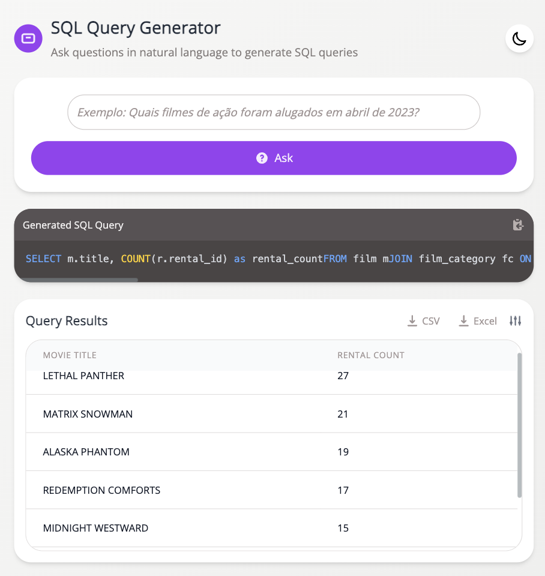

# Auto-SQL

Web application that allows generating SQL queries from natural language questions using AI.

<div align="center">

  

</div>
## Prerequisites

  - Python 3.8+
  - Node.js 16+
  - PostgreSQL
  - Ollama (for the AI model)

## Installation

1.  Clone the repository:

<!-- end list -->

```bash
git clone https://github.com/your-user/chatbot-db.git
cd chatbot-db
```

2.  Set up the PostgreSQL database:

<!-- end list -->

  - Create a database named `pagila`
  - Import the database schema (you can use the `pagila-schema.sql` file)

<!-- end list -->

3.  Install backend dependencies:

<!-- end list -->

```bash
cd backend
python -m venv venv
source venv/bin/activate  # On Windows: venv\Scripts\activate
pip install -r requirements.txt
```

4.  Install frontend dependencies:

<!-- end list -->

```bash
cd ../frontend
npm install
```

5.  Configure environment variables:

<!-- end list -->

  - Copy the `.env.example` file to `.env` in the backend directory
  - Adjust the database settings in the `.env` file

## Running the application

1.  Start the backend server:

<!-- end list -->

```bash
cd backend
source venv/bin/activate  # On Windows: venv\Scripts\activate
python main.py
```

2.  In another terminal, start the frontend server:

<!-- end list -->

```bash
cd frontend
npm start
```

3.  Access the application at `http://localhost:3000`

## Usage

1.  Type your natural language question into the text field
2.  Click "Ask" to generate the SQL query
3.  The generated query will be displayed and executed automatically
4.  The results will be shown in a table below
5.  You can copy the SQL query or export the results to CSV

## Majority Vote System

To handle potential inconsistencies in the model's responses, a majority vote system was implemented that executes each question multiple times and selects the most frequent result.

### How it works

1.  Each question is sent to the model multiple times (default: 5 times)
2.  **The actual results (table data) returned by each query are compared**, not just the SQL query text
3.  If any result appears at least twice, it is selected as correct
4.  If all results are different, the system marks the result as inconclusive
5.  Results without errors are preferred over results with errors

### Running tests with majority vote

To run the majority vote system:

```bash
python run_majority_vote.py

# With custom options:
python run_majority_vote.py --runs 10 --timeout 120
```

The results will be saved in `backend/majority_vote_results.json`. To analyze the results:

```bash
python analyze_results.py

# To display detailed results:
python analyze_results.py --verbose
```

For more information, see the `backend/README_MAJORITY_VOTE.md` file.

## Technologies used

  - Frontend: React, Tailwind CSS
  - Backend: Python, FastAPI
  - Database: PostgreSQL
  - AI: Ollama with Llama 3 model
